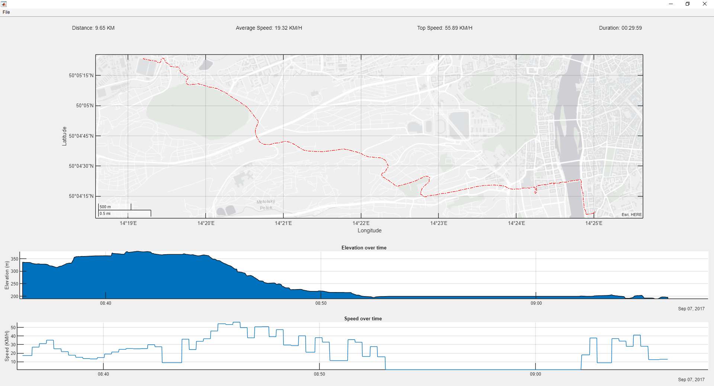

# MtbGPS
Processing of *.gpx files with data from GPS receivers.

## How to run
1. Open Matlab
2. Lunch script called `gui.m`
3. Click **File --> Open** on the top menu
4. Open some .gpx file (you can use samples from **data** folder)
5. Then you should see something like this

## Description
### Evaluation of:
* Distance traveled
* Duration 
* Speed (top, average)
* Elevation (progress, top)
* Route displayed in map

To read data from *.gpx files use the function [loadgpx.m](https://cw.fel.cvut.cz/wiki/_media/courses/b0b17mtb/loadgpx.m)
Display the route on the map using the **geoplot** function, resp. class **GeographicAxes** (function geoaxes).

## Conventions
* https://www.mathworks.com/matlabcentral/fileexchange/2529-matlab-programming-style-guidelines
* https://www.mathworks.com/matlabcentral/fileexchange/46056-matlab-style-guidelines-2-0
